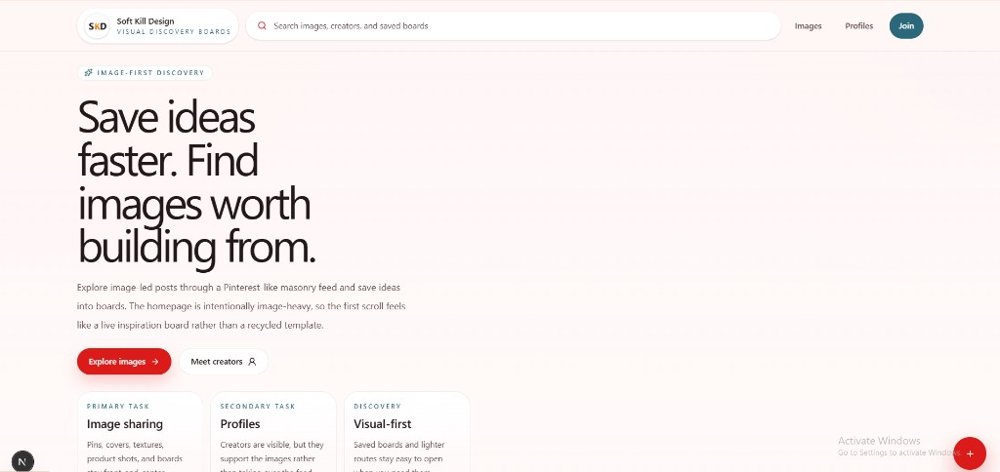
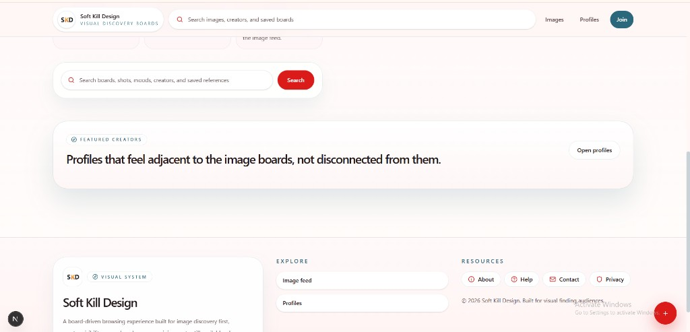
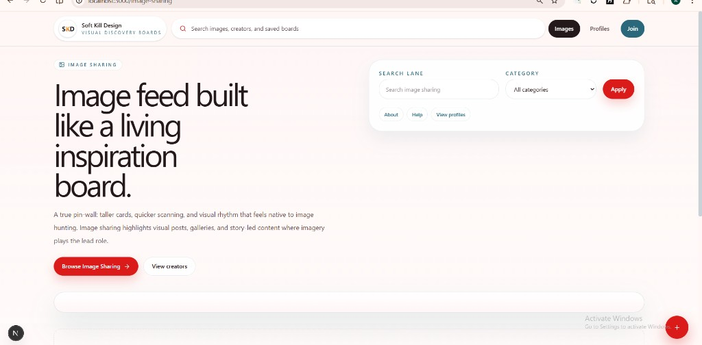
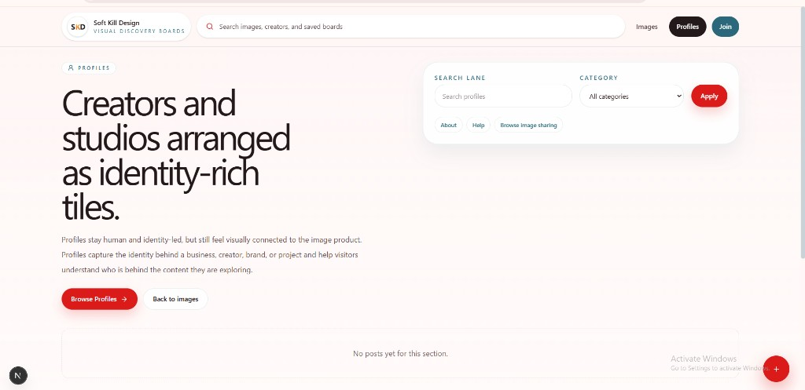
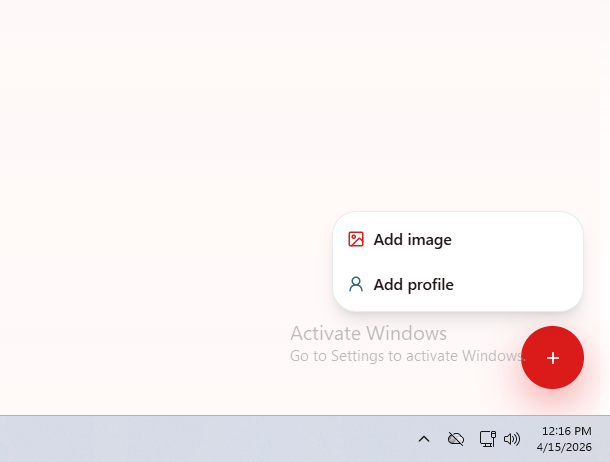

# Soft Kill Design

Visual discovery boards — a Next.js experience built around image-first feeds, creator profiles, and a Pinterest-inspired UI shell.

## Screenshots

### Home — hero



### Home — featured creators & footer



### Image sharing



### Profiles



### Floating create menu



## Development

```bash
pnpm install
pnpm dev
```

Open [http://localhost:3000](http://localhost:3000).

## Updating README images

Replace the files in [`docs/readme/`](docs/readme/) (same filenames) if you capture new UI screenshots; the Markdown above uses **relative paths** so images render on GitHub after you commit and push.
